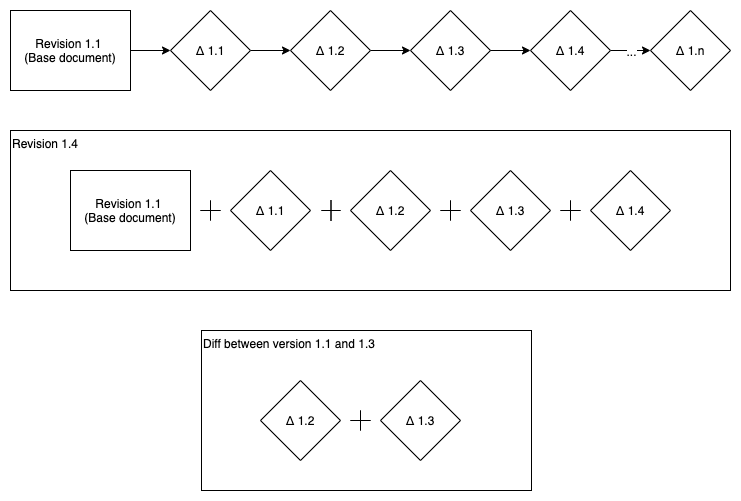

# Node.js Fullstack Engineer Challenge

You can submit all the answers to this assignment in a single repository (or as a zipped folder), containing markdown and code.

**For questions 3-5 use the latest Node LTS**.

## 0. Questions from email
- When would you be available? What's your experience working remotely? (we're fully remote at Reedsy!)
  - I have to give one month's notice at my current job. I don’t work Wednesdays in my current job so in theory I could start onboarding on Wednesdays immediately. I have worked with teams spanning other countries (Romania, the UK, Belgium, and India while my team is based in the Netherlands) but I have always been based in a locally working team.
- Do you have a resume, website or GitHub account with projects you've worked integrating design and using Angular/Node?
  - I have a self hosted CV here: https://isabellerochecouste.me/ which details my professional experience. I’ve been working with Angular and Node daily for the past 3 and a half years.
- What's your rate or current salary?
  - My current salary is €50,000 per annum.
- What's your favorite Giphy?
  - I’m very glad you asked. I have 2. The first can be found here: https://doggifpage.com/right-handed. It reminds me a lot of my dog back home and cracks me up every time I see it. The second can be found here: https://gfycat.com/thickhandsomefrog. This one is a GIF that keeps on giving. The more you watch it the more you see, I especially love that the girl in the middle takes a bite out of the other girl’s piece of fruit and then puts it back in her glass. The links to both of these GIFs are in my bookmarks bar and result in some questions when I am screen-sharing. 

## 1. About you

Since July of 2017, I have been working on a fintech blockchain project called we.trade which had just started its second sprint when I joined. Our stack included Angular (although 2+ and not AngularJS) and Node.js, both of which were developed using Typescript. 

The product itself is a trading platform for small and medium enterprises where the unique selling point is that the trading parties' banks offer direct financial services such as invoice financing to the trading parties. The business flow follows a trade from proposal, amending and acceptance, through to invoicing and shipment, and ending on payment of the trade. I understand the risks associated with running a platform where money and services are being exchanged and how important it is to be 100% sure that what you deliver works as expected.

I have worked as a full-stack developer on the project since the beginning, with a focus on back-end and chaincode development, and I have also worked extensively with deployment in Kubernetes using Helm with Concourse as CI/CD.

## 2. Document versioning

Detail how you would store several versioned, text-based documents, and present a schema for your solution.

It should be able to show:
   - the document in its current state
   - the document at any point in its history
   - the changes made between two versions

Strive for disk space efficiency.

After doing some research I see that there are two commonly used solutions. The first being to store a snapshot of each version of the document. The second being to only store the first version of the document and then store the delta between each version and the version that follows it, which is sometimes referred to as delta encoding or the changeset model.

The pro of the first option is that there is far less processing required to get a version of the document as you already have it in its entirety. The con is that it takes up more space per document/document history. The opposite is true for the second option where the pro is that since you are only storing the delta of all subsequent versions, it is less space consuming. The con is that it requires more processing to patch together the deltas to make up the desired version of the document.

Since it has been explicity stated that disk space efficiency should be the key concern in this solution then the proposed decision would be to use delta encoding. The image below depicts how the document can be retrieved in its current state or at any point in its revision history. To retrieve the changes made between two versions you can retrieve the earlier version in its entirety and then highlight the deltas between that version and the later version. 



Each 'delta object' should also contain some information on who made the changes and a timestamp.

## 3. Node.js REST API

Implement a REST API using Express.js that handles Export and Import requests. The solution should ideally be written in Typescript, or else using plain JavaScript's `class` structure.

The API should expose endpoints to:
- `POST` a request for a **new Export job**. Valid requests should be saved in memory. Invalid requests should return an error. The request must have the following schema:

  ```javascript
  {
    bookId: string,
    type: "epub" | "pdf"
  }
  ```

- `GET` a list of **Export requests**, grouped by their current `state` (see below).
- `POST` a request for a new **Import job**. Valid requests should be saved in memory. Invalid requests should return an error. The request must have the following schema:

  ```javascript
  {
    bookId: string,
    type: "word" | "pdf" | "wattpad" | "evernote",
    url: string
  }
  ```

- `GET` a list of **Import requests**, grouped by their current `state` (see below).

Both export and import requests should be created with a `pending` state, and with a `created_at` timestamp. An import or export should take the amount of time outlined below. After the specified time, the state should be updated from `pending` to `finished` and update an `updated_at` timestamp.

| Job type     | Processing time (s) |
| ------------ | ------------------- |
| ePub export  | 10                  |
| PDF export   | 25                  |
| import (any) | 60                  |

**Add test coverage as you see fit.**

The project should be responsible for managing all the required dependencies and should run just by using:
- `yarn install` + `yarn start`
or
- `npm install` + `npm start`.


## 4. AngularJS

Using **Vue.js or AngularJS (1.x)**, create a basic SPA that implements the following UI:


- Each page should display 5 books;
- A few pages should be available in order for pagination to work;
- Book entries should be clickable and expand/collapse to show/hide more information about the selected book;
- Book store links should only be displayed when the respective URL is available; make different entries as represented on the images above so different store availability scenarios are represented;
- Improve the UI as you think works best.

**Add test coverage as you see fit.**

The project should be responsible for managing all the required dependencies and should run just by using:
-  `yarn install` + `yarn start`
or
- `npm install` + `npm start`.


## 5. Bonus Question

When multiple users are collaborating on a document, collisions in their edits inevitably occur. Implement a module that can handle basic text update operations, and combine two colliding edits into a single operation.

An operation is described as an array of any combination of three types of edits:

- `{ move: number }` to advance the caret
- `{ insert: string }` to insert the string at caret
- `{ delete: number }` to delete a number of chars from the caret onwards

Implement the following methods:
- `Operation.prototype.combine(operation)` Updates the operation by combining it with another colliding operation
- `Operation.combine(op1, op2)` Static method that returns a new operation by combining the arguments without mutating them
- `Operation.prototype.apply(string)` Applies the operation to the provided argument

For example:

```javascript
const s = "abcdefg";
const op1 = new Operation([{ move: 1 }, { insert: "FOO" }]);
const op2 = new Operation([{ move: 3 }, { insert: "BAR" }]);

op1.apply(s); // => "aFOObcdefg"
op2.apply(s); // => "abcBARdefg"

const combined1 = Operation.combine(op1, op2); // => [{ move: 1 }, { insert: 'FOO' }, { move: 2}, { insert: 'BAR' } ]
combined1.apply(s); // => "aFOObcBARdefg"

const combined2 = Operation.combine(op2, op1);
// NB: This expectation is true for this specific case, but not in the general case.
// Can you think of an example where this assertion might not be true?
expect(combined2.apply(s)).to.equal(combined1.apply(s));
```

**Add test coverage to demonstrate the module functionality.** Again, TypeScript is preferred in this solution.

The project should be responsible for managing all the required dependencies and should run just by using:
- `yarn install` + `yarn test`
or
- `npm install` + `npm test`.
